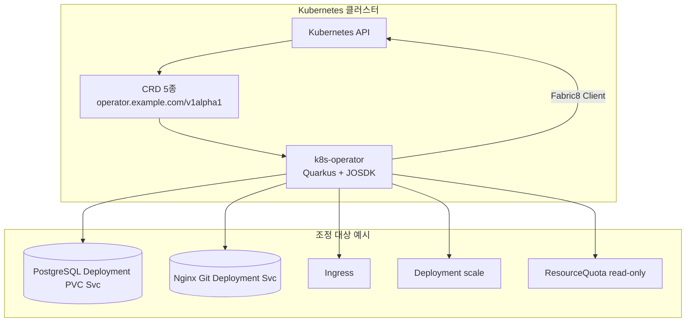
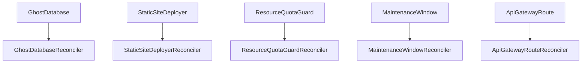

# 아키텍처 개요

## 1. 목적

Kubernetes **Custom Resource Definition(CRD)** 5종을 정의하고, **Quarkus Operator SDK(Java Operator SDK)** 기반 **Reconciler**가 각 리소스의 **생명주기**에 맞춰 하위 리소스를 생성·갱신한다.

## 2. 논리 구성



> **다이어그램 설명:** 이 다이어그램은 쿠버네티스 클러스터 내에서 오퍼레이터가 동작하는 로지컬 아키텍처를 보여줍니다. 오퍼레이터는 클러스터 내 API 서버와 통신하며 사용자가 정의한 다양한 Custom Resource를 감시하고 필요한 2차 파생 리소스(Deployment, Service, PVC 등)를 제어 및 생성합니다.


## 3. CRD와 Reconciler 매핑



> **다이어그램 설명:** 이 다이어그램은 각 사용자 정의 리소스(CR)가 어떤 Controller(Reconciler) 로직과 매핑되어 제어되는지 전체적인 1:1 대응 관계를 보여줍니다. 각 CR은 전담 Reconciler 클래스에 의해 결합도 없이 독립적으로 관리됩니다.


## 4. 기술 스택

| 계층 | 기술 |
|------|------|
| 런타임 | Java 17, Quarkus 3.33.x |
| Operator | quarkus-operator-sdk 7.7.x, JOSDK 5.3.x |
| K8s 클라이언트 | Fabric8 (quarkus-kubernetes-client) |
| 이미지 | quarkus-container-image-docker |
| 빌드 | Maven |

## 5. 패키지 구조(요약)

```
com.example.k8soperator
├── common/OwnerRefs.java
├── ghostdatabase/
├── staticsite/
├── resourcequota/
├── maintenance/
└── apigateway/
```

## 6. 공통 패턴

- **OwnerReference**: 하위 리소스에 컨트롤러 소유자를 설정해 CR 삭제 시 가비지 컬렉션과 정합성을 맞춘다(`OwnerRefs.controllerRef`).
- **Status**: Reconciler는 `UpdateControl.patchStatus`로 `phase`, `message` 등을 갱신한다.
- **주기 조정**: `ResourceQuotaGuard`, `MaintenanceWindow`는 `@ControllerConfiguration(maxReconciliationInterval = …)`로 최대 재조정 간격을 두어 시간·쿼터 변화에 대응한다.

## 7. 관련 문서

- [GhostDatabase](ghostdatabase.md)
- [StaticSiteDeployer](static-site-deployer.md)
- [ResourceQuotaGuard](resource-quota-guard.md)
- [MaintenanceWindow](maintenance-window.md)
- [ApiGatewayRoute](api-gateway-route.md)
