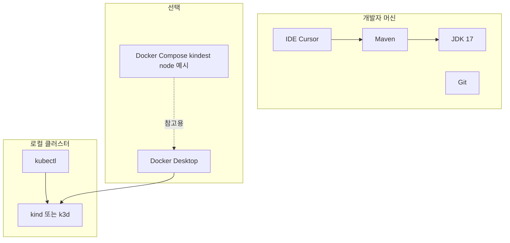
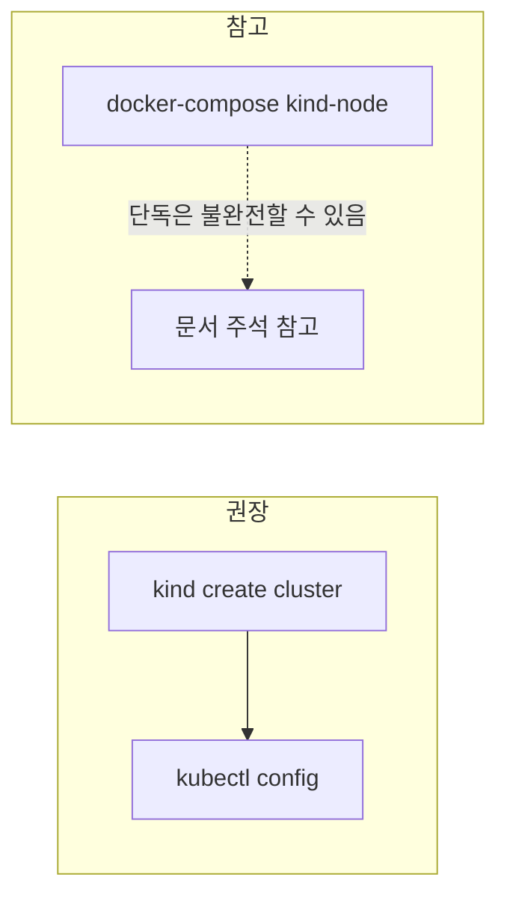

# 개발 환경 — 개발 산출물

## 1. 권장 환경

요청서(`implemetation.md`)와의 정합을 기준으로 한 권장 구성이다.

| 구분 | 권장 |
|------|------|
| OS | Windows 10/11 + **WSL2 (Ubuntu)** |
| 컨테이너 | Docker Desktop (WSL2 백엔드) |
| JDK | **17+** (프로젝트 `maven.compiler.release=17`) |
| 빌드 | **Apache Maven** 3.9+ |
| 로컬 K8s | **kind** 또는 **k3d** (kubectl) |

## 2. 도구 관계

> **다이어그램 설명:** 이 다이어그램은 로컬 개발 환경의 구성 요소와 프로세스 흐름을 나타냅니다. 개발자 IDE(Cursor)에서 코드를 수정한 뒤 Maven으로 빌드하고, 이를 Docker Compose 또는 경량 쿠버네티스 클러스터 환경(k3d/kind)에 적재시키는 전반적인 파이프라인입니다.

## 3. Docker Compose (프로젝트 내)

파일: `docker-compose.yml`

- 요청서 예시대로 `kindest/node` 이미지를 올리는 **템플릿**이 포함되어 있다.
- **실제로 사용 가능한 kube-apiserver**를 얻으려면 일반적으로 **kind/k3d CLI**로 클러스터를 생성하고 `KUBECONFIG`를 사용하는 것이 안전하다.

> **다이어그램 설명:** 이 다이어그램은 호스트 머신(Windows/WSL)에서 Docker 내부에 구동 중인 K3s 클러스터 컨트롤 플레인으로 네트워크가 어떻게 연결되는지(Kubeconfig 주소 치환 흐름)를 직관적으로 나타냅니다.

## 4. Kubernetes 접근

Operator는 **현재 kubeconfig**로 클러스터에 연결한다(로컬 개발 시 `~/.kube/config`).

## 5. 관련 문서

- [빌드 및 배포](build-and-deploy.md)
- [테스트 및 검증](testing-and-verification.md)
