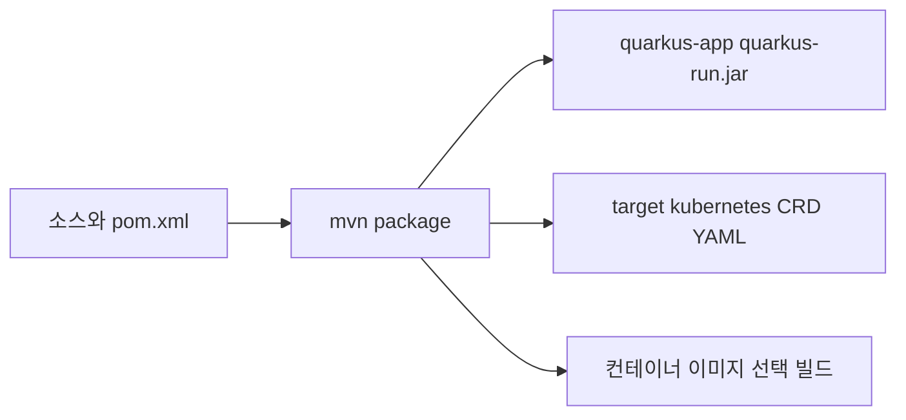
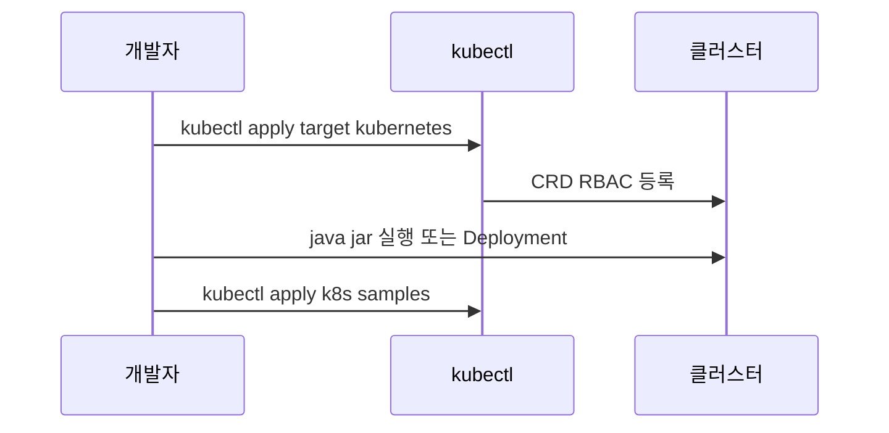
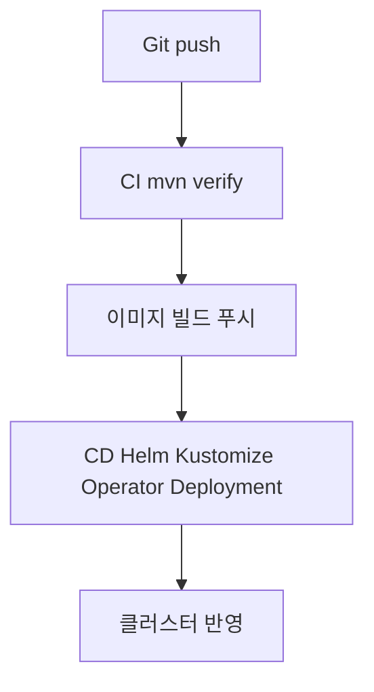

# 빌드 및 배포 — 개발 산출물

## 1. 산출물 개요



> **다이어그램 설명:** 프로젝트의 아티팩트 빌드 파이프라인 구조도입니다. Maven 패키징 타임에 내부 소스 스캐닝을 통해 Quarkus Operator SDK가 K8s 매니페스트(CRD)와 런타임용 Jar 파일을 추출하여 도커 이미지로 패키징하는 일련의 과정입니다.


## 2. 빌드 명령

프로젝트 루트 `k8s-operator/`:

```bash
mvn -DskipTests package
```

- **실행 가능 JAR**: `target/quarkus-app/quarkus-run.jar` 및 의존 `lib/`
- **CRD**: Quarkus Operator SDK가 생성한 매니페스트는 `target/kubernetes/`에 출력된다(버전에 따라 경로 확인).

## 3. CRD 및 Operator 적용 흐름



> **다이어그램 설명:** 빌드된 매니페스트(CRD/RBAC)와 운영 이미지를 최종 클러스터에 배포하는 시퀀스입니다. 인프라 기반인 CRD를 먼저 안정적으로 클러스터에 적용한 후 오퍼레이터 본체(Deployment) 기동을 순서 보장 흐름입니다.


## 4. 로컬 실행

```bash
java -jar target/quarkus-app/quarkus-run.jar
```

개발 모드(핫 리로드·Dev UI):

```bash
mvn quarkus:dev
```

## 5. 컨테이너 이미지

`application.properties`에 `quarkus.container-image.*`가 정의되어 있다.  
Docker가 있는 환경에서 예:

```bash
mvn package -Dquarkus.container-image.build=true
```

이미지 좌표는 빌드 시 프로퍼티·레지스트리 설정에 따른다.

## 6. 배포 파이프라인(권장 확장)



> **다이어그램 설명:** 향후 프로덕션 도입 시 구성될 수 있는 CI/CD 자동화 파이프라인(Git Push -> 테스트 검증 -> 컨테이너 릴리스 -> Operator Deployment)의 이상적인 흐름을 안내합니다.


현재 리포지토리에는 CI/CD 파일을 포함하지 않았다. 조직 표준에 맞게 GitHub Actions, GitLab CI 등을 추가하면 된다.

## 7. 참고 텍스트

루트 `DEPLOY.txt`에 요약 명령이 있다.

## 8. 관련 문서

- [개발 환경](development-environment.md)
- [아키텍처 개요](architecture.md)
