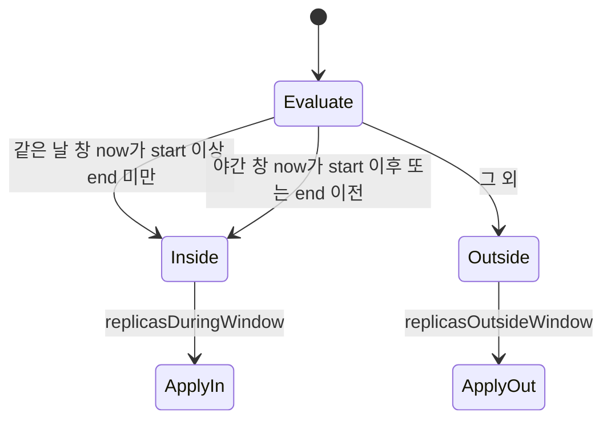
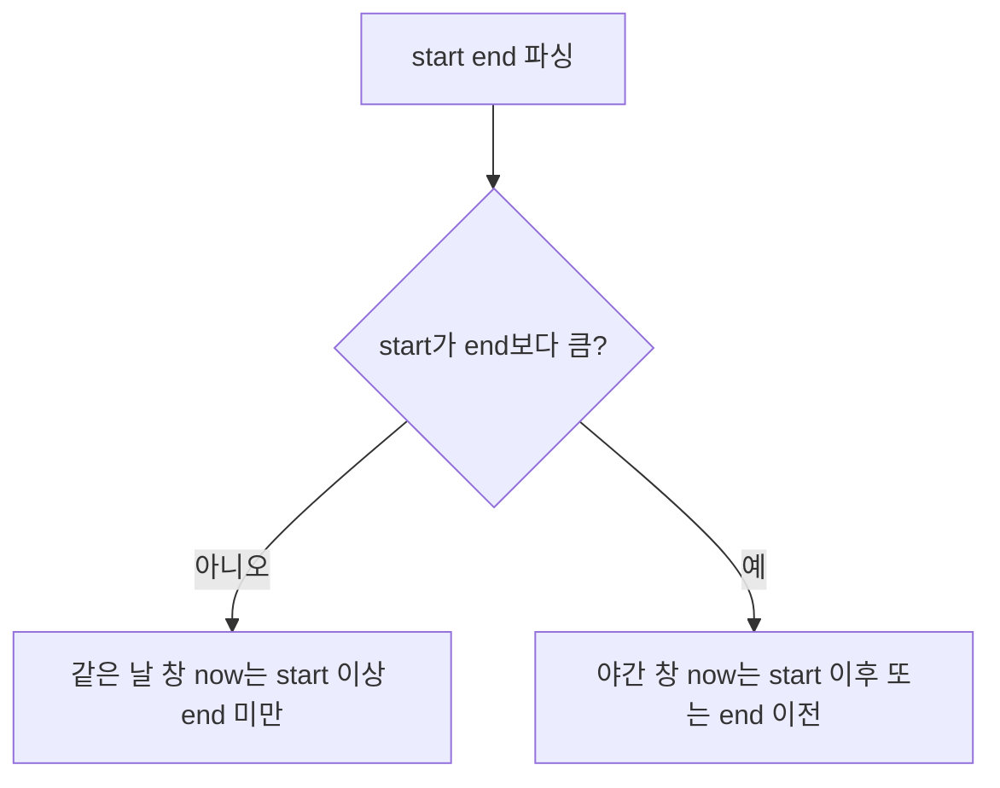
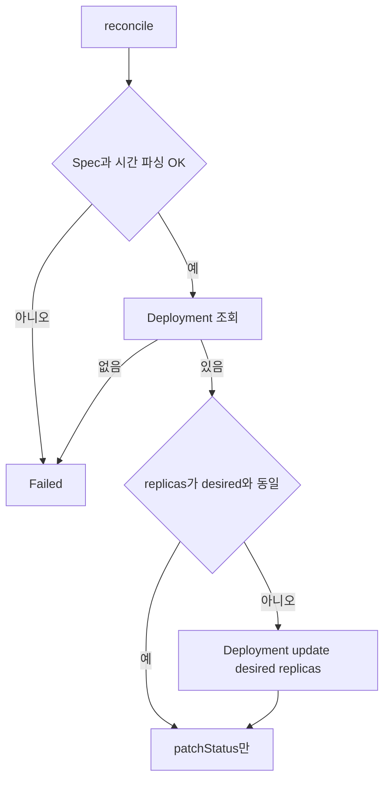
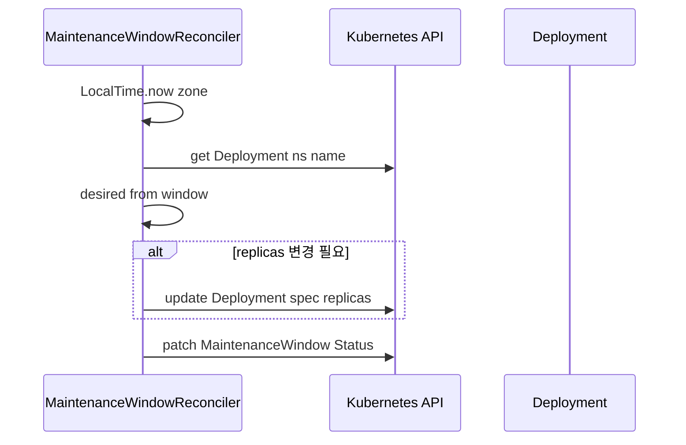

# MaintenanceWindow — 개발 산출물

## 1. 기능 요약

지정 **Deployment**에 대해, **타임존** 기준 **로컬 시각**이 업무 창 안에 있으면 `replicasDuringWindow`, 밖이면 `replicasOutsideWindow`로 스케일한다.  
**야간 창**(예: 22:00–06:00)은 시작 시각이 종료보다 “큰” 경우로 판별한다.

소스: `com.example.k8soperator.maintenance.*`

## 2. CRD 식별자

| 항목 | 값 |
|------|-----|
| Kind | `MaintenanceWindow` |
| Plural | `maintenancewindows` |

## 3. Spec / Status

### 3.1 Spec

| 필드 | 필수 | 설명 |
|------|------|------|
| `targetNamespace` | 예 | 대상 Deployment 네임스페이스 |
| `deploymentName` | 예 | 조정할 Deployment 이름 |
| `timezone` | 아니오 | IANA ID, 기본 `UTC` |
| `windowStart` | 예 | `HH:mm` |
| `windowEnd` | 예 | `HH:mm` (종료 시각 **미포함**) |
| `replicasDuringWindow` | 아니오 | 기본 `1` |
| `replicasOutsideWindow` | 아니오 | 기본 `0` |

### 3.2 Status

| 필드 | 설명 |
|------|------|
| `phase` | `Ready` / `Failed` |
| `withinWindow` | 현재 창 안 여부 |
| `appliedReplicas` | 마지막으로 적용한 replica 수 |
| `message` | 설명 |

## 4. 창 판별 상태 머신(개념)

> **다이어그램 설명:** Maintenance Window(유지보수 레플리카 조정) Reconciler의 상태 전이 모델입니다. 현재 시간이 설정된 window 범위 사이에 있는지(Inside), 밖에 있는지(Outside)를 지속 평가하여 목표 레플리카를 결정하는 흐름 체계를 보여줍니다.

## 5. 같은 날 창 vs 야간 창

> **다이어그램 설명:** 시간 검증 프로세스(Time Match) 내부 논리를 판단하는 과정입니다. LocalTime 기반으로 현재 시간이 설정된 시작 시간과 종료 시간 사이에 들어가는지 엄격히 파싱하고 평가합니다.

구현: `MaintenanceWindowReconciler.withinWindow` (단위 테스트로 검증)

## 6. 조정 흐름

> **다이어그램 설명:** MaintenanceWindow 컨트롤러의 실제 Reconcile 동작 순서도입니다. 대상 Target Deployment를 찾아 현재 Replica 수가 스펙의 요구치와 맞는지 대조한 뒤, 불일치하면 Patch Request를 날려 최신 상태로 업데이트 합니다.

**주기**: `maxReconciliationInterval` 1분 — 창 전환 시각에 맞춰 반복 적용된다.

## 7. 시퀀스

> **다이어그램 설명:** 컨트롤러 서버와 클러스터 K8s API 서버 내부 통신 상호작용(API Call) 시퀀스를 보여줍니다. 쿼리를 통해 타겟의 존재 유무를 확인하고 상태를 반영(Patch Status)하는 일련의 네트워크 트랜잭션 단위입니다.

## 8. 샘플

- `k8s/samples/maintenancewindow-sample.yaml` (`deploymentName`를 실제 워크로드에 맞게 수정)

## 9. 제한

- **Cron 표현식**은 사용하지 않고 `HH:mm` 구간만 지원한다.
- DST(일광절약시간) 전환일에는 ZoneId 동작에 따른 경계 이슈가 있을 수 있다.

## 10. 관련 문서

- [테스트 및 검증](testing-and-verification.md) (창 판별 단위 테스트)
- [아키텍처 개요](architecture.md)
