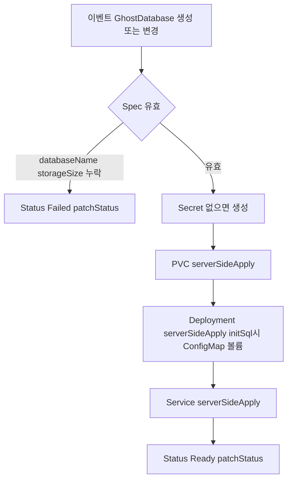
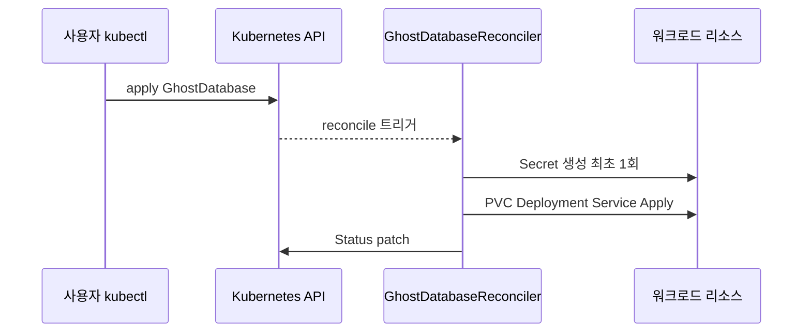

# GhostDatabase — 개발 산출물

## 1. 기능 요약

개발자가 CR **Spec**에 DB 이름·스토리지 크기 등을 적으면, Reconciler가 동일 네임스페이스에 다음을 맞춘다.

- **Secret**: `POSTGRES_USER`, `POSTGRES_PASSWORD`, `POSTGRES_DB` (Secret이 없을 때만 생성해 비밀번호가 매 조정마다 바뀌지 않도록 함)
- **PersistentVolumeClaim**: 요청 용량
- **Deployment**: PostgreSQL 컨테이너(기본 이미지 `postgres:16-alpine`)
- **Service**: 5432 TCP
- **ConfigMap**(선택): `initSql`이 있으면 `/docker-entrypoint-initdb.d`에 마운트

소스: `com.example.k8soperator.ghostdatabase.*`

## 2. CRD 식별자

| 항목 | 값 |
|------|-----|
| Group | `operator.example.com` |
| Version | `v1alpha1` |
| Kind | `GhostDatabase` |
| Plural | `ghostdatabases` |

## 3. Spec / Status

### 3.1 Spec 필드

| 필드 | 필수 | 설명 |
|------|------|------|
| `databaseName` | 예 | `POSTGRES_DB` 및 사용자명으로 사용 |
| `storageSize` | 예 | PVC 요청량 (예: `1Gi`) |
| `postgresImage` | 아니오 | 기본 `postgres:16-alpine` |
| `initSql` | 아니오 | 최초 초기화용 SQL |

### 3.2 Status 필드

| 필드 | 설명 |
|------|------|
| `phase` | `Ready` / `Failed` |
| `message` | 사람이 읽을 수 있는 설명 |
| `serviceName` | 생성된 Service 이름 |

## 4. 조정(Reconcile) 흐름

> **다이어그램 설명:** GhostDatabase CR이 생성되었을 때 처리되는 플로우차트입니다. 스펙 검증 후 파생 리소스인 보안 Secret, 스토리지 PVC, DB 워크로드 Deployment(Postgres), 내부 접근 Service를 순차적으로 생성/갱신합니다.

## 5. 리소스 이름 규칙

접두사 `ghostdb-{metadata.name}`:

- `{base}-secret`
- `{base}-pvc`
- `{base}` Deployment / Service
- `{base}-init` ConfigMap (`initSql` 사용 시)

## 6. 시퀀스(클러스터 관점)

> **다이어그램 설명:** GhostDatabase 애플리케이션이 사용자에 의해 클러스터 배포될 때의 전체 API 시퀀스 다이어그램입니다. Operator SDK가 각 단계별 K8s 리소스 생성 이벤트와 최종 Status 반영을 트리거하는 과정을 보여줍니다.

## 7. 샘플 및 검증 포인트

- 샘플: `k8s/samples/ghostdatabase-sample.yaml`
- 검증: PVC Bound, Pod Running, Service Endpoints, (선택) init SQL 반영 여부

## 8. 제한·주의

- 이미 데이터가 있는 PVC에서 `initSql`만 바꿔도 **재실행이 보장되지 않음**(Postgres entrypoint 동작에 따름).
- 프로덕션에서는 백업·리소스 요청/제한·네트워크 정책을 별도 설계하는 것이 좋다.

## 9. 관련 문서

- [아키텍처 개요](architecture.md)
- [테스트 및 검증](testing-and-verification.md)
