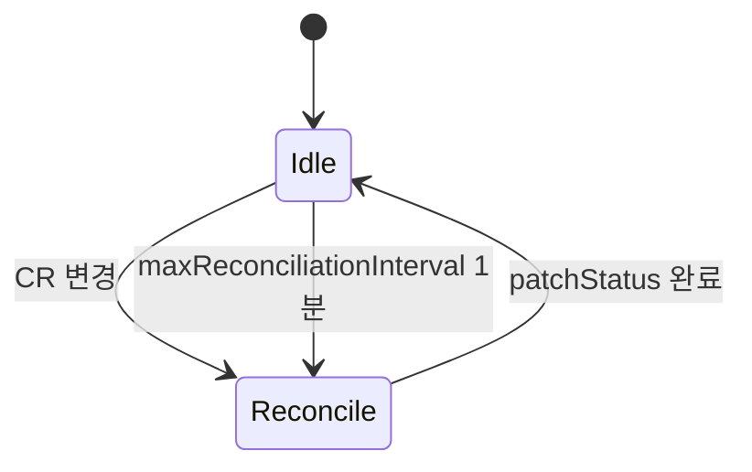
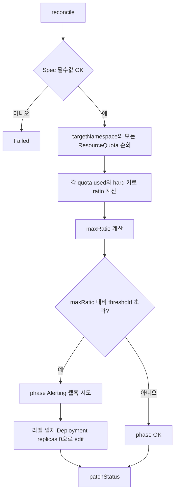
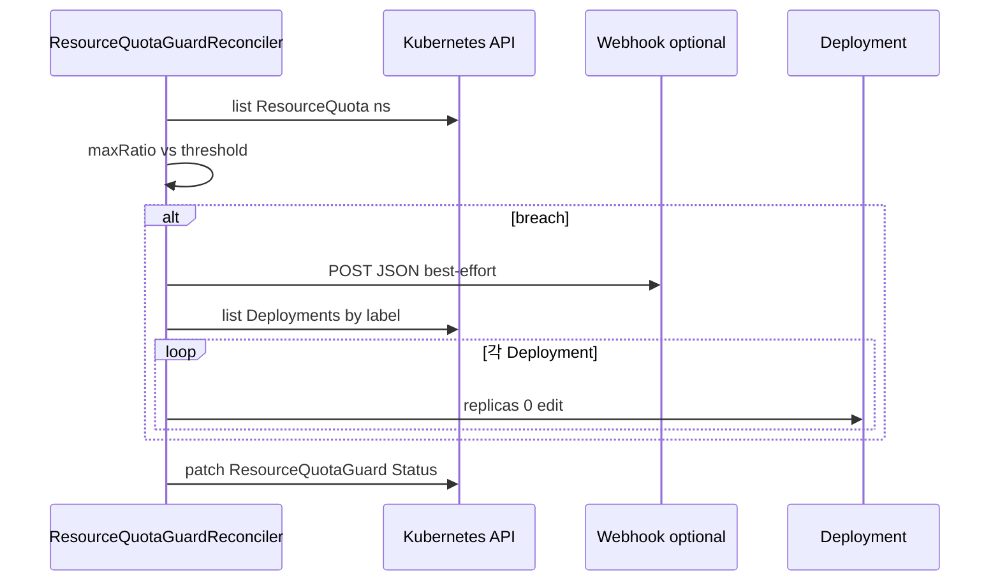

# ResourceQuotaGuard — 개발 산출물

## 1. 기능 요약

지정 **네임스페이스**의 모든 `ResourceQuota`에 대해, `status.used`와 `status.hard`가 모두 있는 키마다 **사용 비율**을 계산하고, 그중 **최댓값**이 임계치(기본 80%) 이상이면:

1. (선택) **웹훅**으로 JSON POST 시도
2. 지정 **라벨**이 붙은 **Deployment**의 `replicas`를 0으로 조정

소스: `com.example.k8soperator.resourcequota.*`

## 2. CRD 식별자

| 항목 | 값 |
|------|-----|
| Kind | `ResourceQuotaGuard` |
| Plural | `resourcequotaguards` |

## 3. Spec / Status

### 3.1 Spec

| 필드 | 필수 | 설명 |
|------|------|------|
| `targetNamespace` | 예 | 쿼터를 읽을 네임스페이스 |
| `thresholdPercent` | 아니오 | 기본 `80` (1–100) |
| `workloadLabelKey` | 예 | 스케일 대상 Deployment 선택 라벨 키 |
| `workloadLabelValue` | 예 | 라벨 값 |
| `notificationWebhookUrl` | 아니오 | 알림용 POST URL |

### 3.2 Status

| 필드 | 설명 |
|------|------|
| `phase` | `OK` / `Alerting` / `Failed` |
| `maxObservedUsageRatio` | 관측된 최대 used/hard 비율 |
| `scaledDownDeployments` | 0으로 줄인 Deployment 이름 목록 |

## 4. 주기 재조정

> **다이어그램 설명:** ResourceQuotaGuard 오퍼레이터의 상태 전이 모델 다이어그램입니다. Idle 상태에서 일정 주기가 도래하거나 감시 리소스가 변경되면 Reconcile 루프가 트리거되어 실시간 네임스페이스 쿼터를 검사합니다.

`@ControllerConfiguration(maxReconciliationInterval = @MaxReconciliationInterval(interval = 1, timeUnit = MINUTES))`  
쿼터는 CR 자체 변경 없이도 변하므로, **주기적 재조정**으로 감시를 보완한다.

## 5. 판단 로직 흐름

> **다이어그램 설명:** 리소스 쿼터의 사용률(Used) 초과 위험도를 분석하는 플로우차트입니다. 쿼터가 지정된 임계치(Threshold)를 초과하게 될 경우 즉시 대상 네임스페이스 워크로드 Deployment의 Replica를 0으로 강제 스케일 다운시키는 방어 메커니즘 차트입니다.

## 6. 비율 계산 시 유의사항

- Kubernetes `Quantity`는 CPU·메모리 등 **단위가 다른 항목**이 섞일 수 있다. 구현은 **같은 키**의 used/hard 쌍에 한해 Fabric8 `Quantity.getNumericalAmount()`로 비율을 구한다.
- **최댓값**만 임계치와 비교하므로, “가장 빡빡한 리소스 기준”으로 breach를 판단한다.

## 7. 시퀀스(임계 초과 시)

> **다이어그램 설명:** ResourceQuotaGuard가 API 서버와 연동해 쿼터를 조회하고, 위험 수준 초과 시 타겟 워크로드의 스케일을 0으로 파괴/축소하는 방어 기동 및 Webhook 발송 시퀀스 흐름입니다.

## 8. 샘플

- `k8s/samples/resourcequotaguard-sample.yaml`

## 9. 운영 메모

- 임계 초과 시 **무조건 스케일 다운**은 서비스 영향이 크므로, 알림만 하거나 `dryRun` Spec을 두는 개선을 고려할 수 있다.
- `ResourceQuota`가 없는 네임스페이스에서는 `maxRatio`가 0에 가깝게 유지되어 breach가 나지 않을 수 있다.

## 10. 관련 문서

- [아키텍처 개요](architecture.md)
