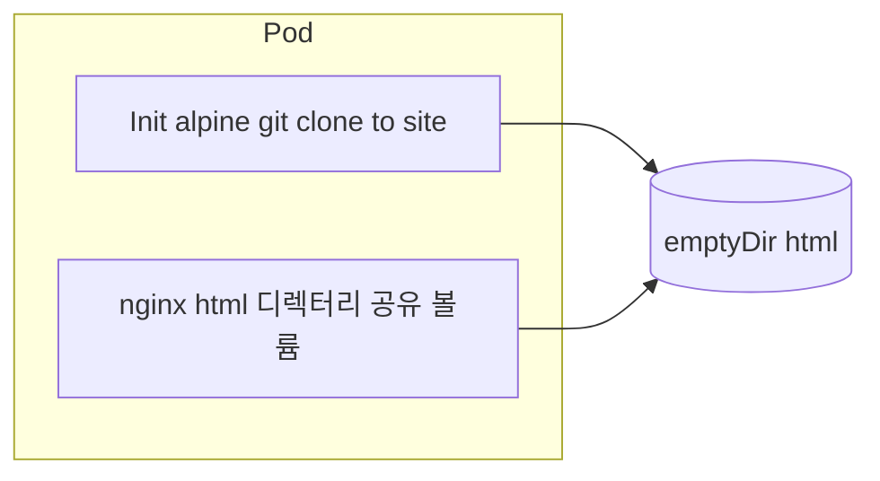
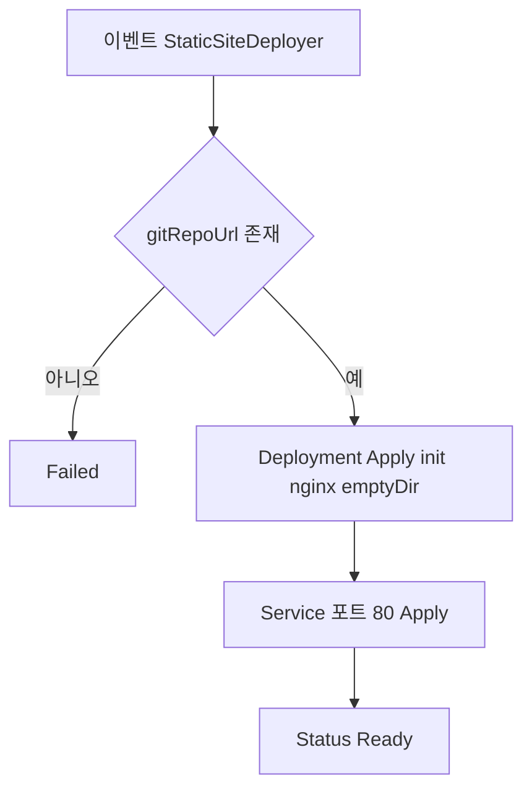
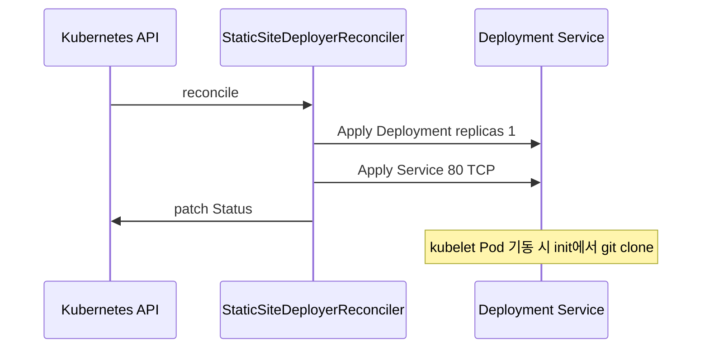

# StaticSiteDeployer — 개발 산출물

## 1. 기능 요약

Git 저장소 URL과 브랜치를 Spec에 두면, **Init Container**에서 저장소를 클론하고 **Nginx**가 동일 `emptyDir` 볼륨의 정적 파일을 서빙한다.

소스: `com.example.k8soperator.staticsite.*`

## 2. CRD 식별자

| 항목 | 값 |
|------|-----|
| Group | `operator.example.com` |
| Version | `v1alpha1` |
| Kind | `StaticSiteDeployer` |
| Plural | `staticsitedeployers` |

## 3. Spec / Status

### 3.1 Spec

| 필드 | 필수 | 설명 |
|------|------|------|
| `gitRepoUrl` | 예 | 공개 저장소 HTTPS URL 등 |
| `branch` | 아니오 | 기본 `main` |
| `nginxImage` | 아니오 | 기본 `nginx:1.25-alpine` |

### 3.2 Status

| 필드 | 설명 |
|------|------|
| `phase` | `Ready` / `Failed` |
| `message` | 배포 요약 안내 |

## 4. Pod 구성(볼륨 공유)

> **다이어그램 설명:** 정적 웹사이트 라이브 호스팅을 위한 최적화 Pod 내부 아키텍처 구조입니다. Init 컨테이너가 Git 저장소의 코드를 emptyDir 임시 볼륨에 클론(Clone)하고, 실행 컨테이너(Nginx)가 해당 마운트 폴더를 웹으로 서빙하는 패턴을 설명합니다.

## 5. 조정 흐름

> **다이어그램 설명:** StaticSiteDeployer CRSpec에 명시된 Git URL과 정보를 기반으로 Deployment 및 Service(네트워크 포트 지정)를 순차적으로 파생 생성해내는 Reconciler 제어 설계도입니다.

## 6. Init 스크립트 개념

- 저장소·브랜치는 환경변수 `GIT_REPO`, `GIT_BRANCH`로 주입
- `/site`에 shallow clone 후 Nginx가 해당 디렉터리를 웹 루트로 마운트

## 7. 시퀀스

> **다이어그램 설명:** 실제 배포 후 쿠버네티스 Kubelet 데몬이 해당 Git 코드를 가져오기 위해 동작하는 내부 기동 시퀀스와, 완료 후 서비스 상태를 Ready로 표기하는 단계별 상호작용입니다.

## 8. 샘플

- `k8s/samples/staticsitedeployer-sample.yaml` (소형 공개 저장소 예시)

## 9. 제한·확장

- **비공개 저장소**: 현재 Spec에 credential/Secret 참조가 없음. 확장 시 `gitCredentialsSecret` 등을 Spec에 추가하고 init에서 마운트하는 패턴을 권장한다.
- **대용량 저장소**: shallow clone만 사용하지만, 빌드 파이프라인과 분리하는 것이 일반적이다.

## 10. 관련 문서

- [아키텍처 개요](architecture.md)
