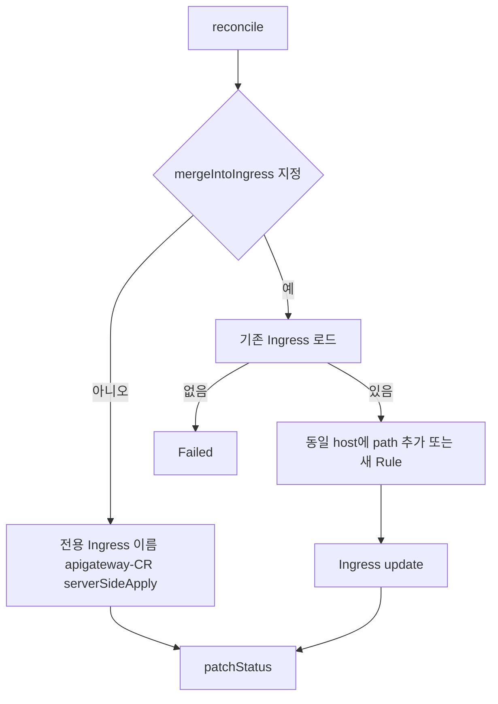
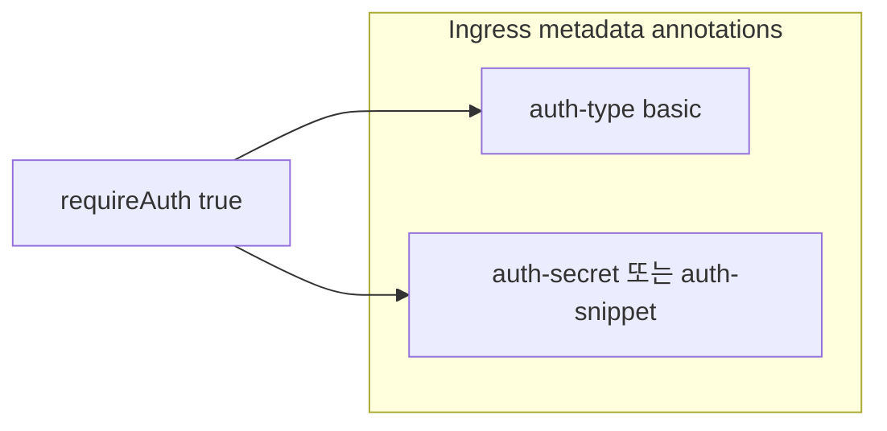
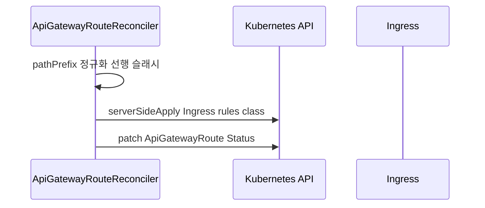

# ApiGatewayRoute — 개발 산출물

## 1. 기능 요약

Spec에 **호스트·경로 프리픽스·백엔드 Service·포트**를 정의하면 `networking.k8s.io/v1` **Ingress**를 생성하거나, 기존 Ingress에 **규칙을 병합**한다.  
`requireAuth`가 true이면 **Nginx Ingress Controller**용 인증 관련 **어노테이션**을 부여한다.

소스: `com.example.k8soperator.apigateway.*`

## 2. CRD 식별자

| 항목 | 값 |
|------|-----|
| Kind | `ApiGatewayRoute` |
| Plural | `apigatewayroutes` |

## 3. Spec / Status

### 3.1 Spec

| 필드 | 필수 | 설명 |
|------|------|------|
| `host` | 예 | Ingress 규칙 호스트 |
| `pathPrefix` | 아니오 | 기본 `/`, `Prefix` pathType |
| `backendServiceName` | 예 | Service 이름 |
| `backendPort` | 예 | 숫자 포트 |
| `ingressClassName` | 아니오 | 전용 Ingress 생성 시에만 spec에 반영 |
| `mergeIntoIngress` | 아니오 | 설정 시 **이 이름의 기존 Ingress**에 규칙 추가 |
| `requireAuth` | 아니오 | Nginx basic 인증 흐름 유도 |
| `authSecretName` | 아니오 | `nginx.ingress.kubernetes.io/auth-secret` |

### 3.2 Status

| 필드 | 설명 |
|------|------|
| `phase` | `Ready` / `Failed` |
| `ingressName` | 생성 또는 병합 대상 Ingress 이름 |
| `message` | 요약 |

## 4. 모드 분기

> **다이어그램 설명:** ApiGatewayRoute 적용 시 기존에 존재하는 Ingress 병합 규칙에 편입(Merge)할지, 혹은 완전히 독립된 단일 Ingress 파생물을 만들어낼지 분기 처리하는 생성 논리 트리입니다.

## 5. 인증 어노테이션(전용 Ingress 생성 시)

전용 Ingress 메타데이터에 다음을 조건부로 추가한다.

- `nginx.ingress.kubernetes.io/auth-type: basic`
- `authSecretName`이 있으면 `nginx.ingress.kubernetes.io/auth-secret` 연결
- 없으면 `nginx.ingress.kubernetes.io/auth-snippet: return 401;` (플레이스홀더 성격)

> **다이어그램 설명:** 인증 파라미터(`requireAuth=true`) 설정 시 Ingress 메타데이터 어노테이션(Annotation)에 베이직 인증 또는 Auth-Snippet 속성이 동적으로 주입되는 트랜슬레이션 원리 설명입니다.

## 6. 병합 규칙 요약

1. 기존 `spec.rules`를 복사한 리스트로 순회한다.
2. **동일 `host`**가 있으면 해당 HTTP 경로 목록에 새 `HTTPIngressPath`를 **추가**한다.
3. 없으면 **새 `IngressRule`**을 추가한다.
4. `client.resource(ingress).update()`로 반영한다.

> 병합 모드에서는 기존 Ingress에 **OwnerReference를 붙이지 않는다**. 운영 정책에 따라 별도 관리가 필요할 수 있다.

## 7. 시퀀스(전용 Ingress)

> **다이어그램 설명:** ApiGatewayRoute CR을 분석 후 순수 표준 Ingress 스펙으로 변환하여 쿠버네티스 Ingress 컨트롤러에 투표/적용(Server-Side Apply)하는 동작 통신 시퀀스입니다.

## 8. 샘플

- `k8s/samples/apigatewayroute-sample.yaml`

## 9. 전제

- 실제 트래픽 처리에는 클러스터에 **Ingress Controller**(예: nginx-ingress)가 설치되어 있어야 한다.
- TLS는 본 CR의 초기 구현 범위에서 자동 생성하지 않는다. 필요 시 Ingress `spec.tls` 확장을 검토한다.

## 10. 관련 문서

- [아키텍처 개요](architecture.md)
