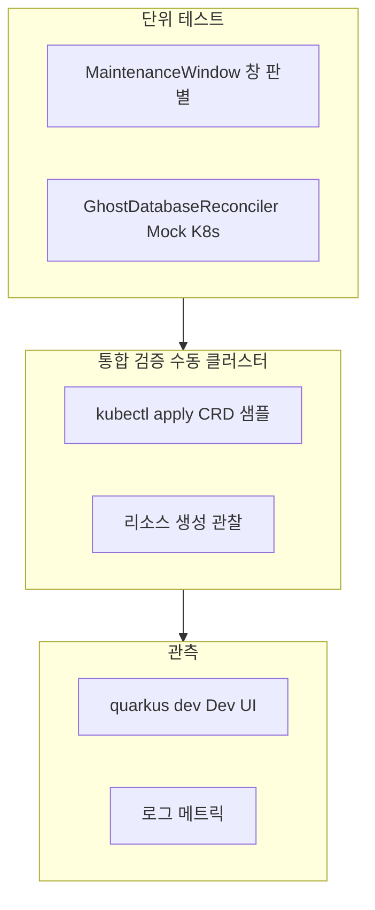
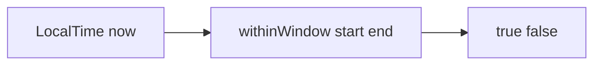
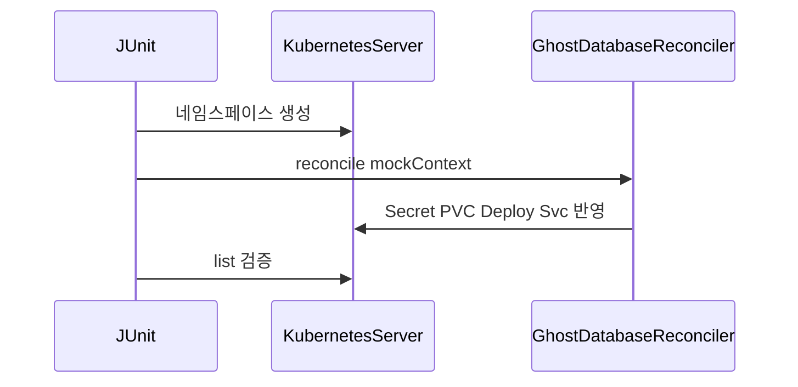
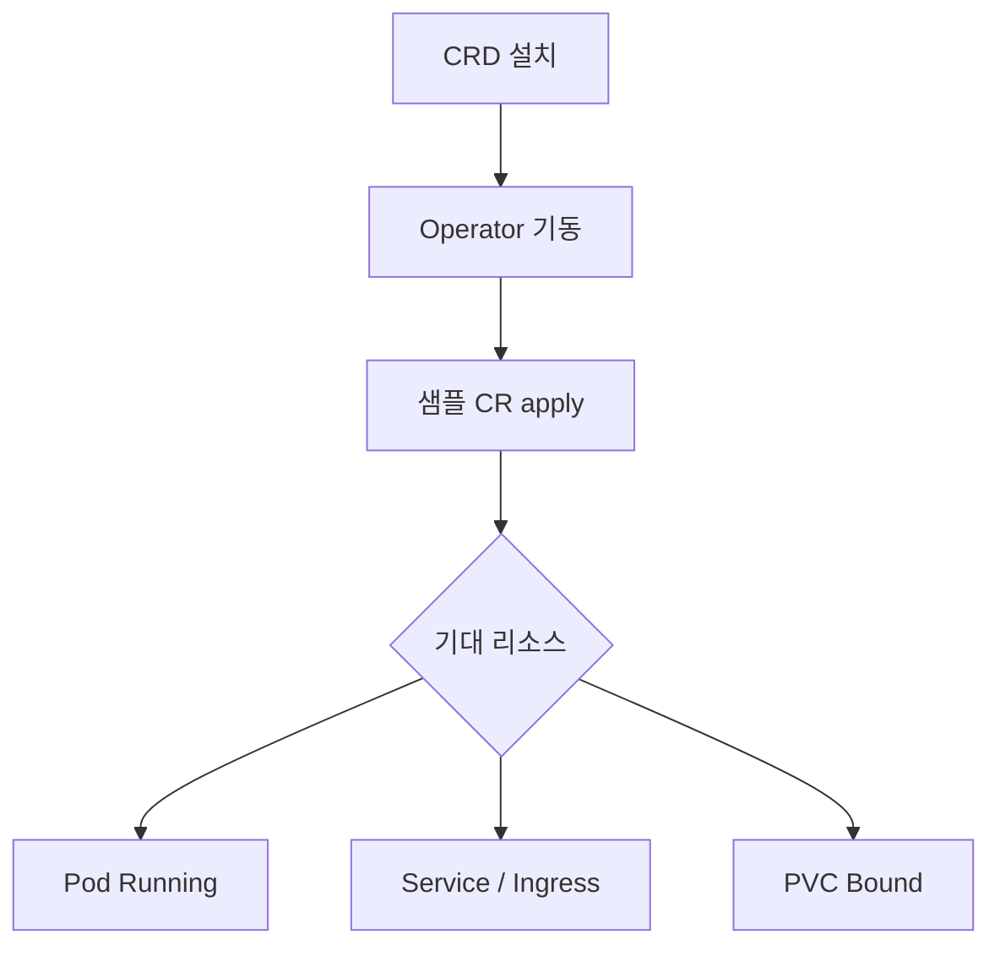
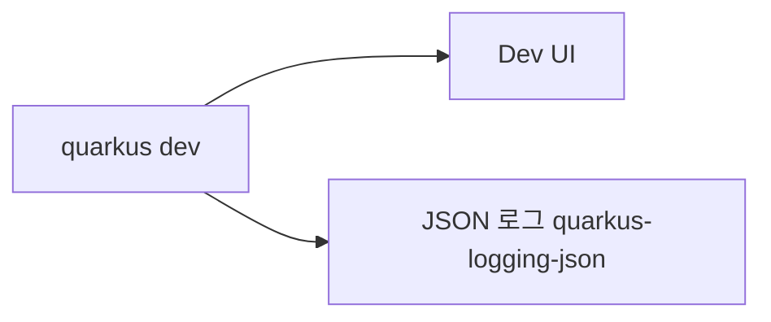

# 테스트 및 검증 — 개발 산출물

## 1. 전략 개요

요청서의 검증 방안에 맞춘 **계층**을 다음과 같이 정리한다.



> **다이어그램 설명:** 단위 테스트, 통합 테스트, 외부 클러스터 배포 후 관측(Observability)에 이르는 3단계 점진적 오퍼레이터 품질 보증/테스트 전략을 보여주는 아키텍처입니다.


## 2. Maven 테스트 실행

```bash
mvn test
```

## 3. 단위 테스트 상세

### 3.1 MaintenanceWindow — 창 판별

- **파일**: `src/test/java/.../maintenance/MaintenanceWindowLogicTest.java`
- **내용**: 같은 날 창(09:00–18:00), 야간 창(22:00–06:00)에 대해 `withinWindow` 결과를 검증한다.



> **다이어그램 설명:** 외부 API 및 인프라 종속성 없이 순수 비즈니스 로직(시간 단위 윈도우 계산 등)만을 완벽히 고립시켜(Isolation) 검증하는 JUnit 모의(Mock) 방식 플로우입니다.


### 3.2 GhostDatabase — Reconciler + Mock API 서버

- **파일**: `src/test/java/.../ghostdatabase/GhostDatabaseReconcilerTest.java`
- **도구**: Fabric8 `KubernetesServer` (CRUD 모드)
- **검증**:
  - Spec이 유효할 때 PVC, Secret, Deployment, Service가 생성되는지
  - `databaseName` 누락 시 `phase=Failed`인지
- **Context**: JOSDK `Context`는 Mockito mock으로 전달한다.



> **다이어그램 설명:** Fabric8 Kubernetes Mock 서버 컴포넌트를 활용한 가상 K8s 통합 테스트 프레임워크 시퀀스입니다. 실제 API 서버가 띄워져있는 것처럼 Mocking 처리하여 CR의 상태 변화와 생성 여부를 CI에서 고속으로 수행해냅니다.


## 4. 통합 검증(클러스터)

1. `mvn package` 후 `kubectl apply -f target/kubernetes/`
2. Operator 프로세스 또는 Pod 실행
3. `k8s/samples/*.yaml` 적용
4. `kubectl get pods,svc,pvc,ingress` 등으로 기대 리소스 확인



> **다이어그램 설명:** 테스트 자동화를 거친 후 실제로 수동 E2E(End to End) 시스템 검증을 통과해야 하는 파이프라인으로, CRD 설치부터 컨테이너 정상 구동, 바인딩 완료 여부 확인까지의 관리자 워크플로우를 안내합니다.


## 5. 관측(Quarkus)

- **Dev UI**: `mvn quarkus:dev` 실행 후 브라우저에서 Quarkus Dev UI로 애플리케이션·확장 상태를 확인할 수 있다.
- **로그**: Reconciler 예외·웹훅 실패 등은 애플리케이션 로그로 추적한다.



> **다이어그램 설명:** Quarkus 프레임워크에 내장된 Dev UI 도구 모음과 구조적 JSON 로깅 인터페이스를 통해 시스템 오퍼레이터를 어떻게 실시간 관찰(Observability)하고 디버깅할지 시각화한 모니터링 방식입니다.


## 6. 커버리지 확장 아이디어

| 영역 | 제안 |
|------|------|
| 나머지 Reconciler | Mock 클라이언트로 성공/실패 분기 테스트 |
| ApiGateway 병합 | 기존 Ingress fixture로 rule 병합 검증 |
| ResourceQuota | `ResourceQuota` status fixture로 breach 시나리오 |

## 7. 관련 문서

- [GhostDatabase](ghostdatabase.md)
- [개발 환경](development-environment.md)
- [빌드 및 배포](build-and-deploy.md)
